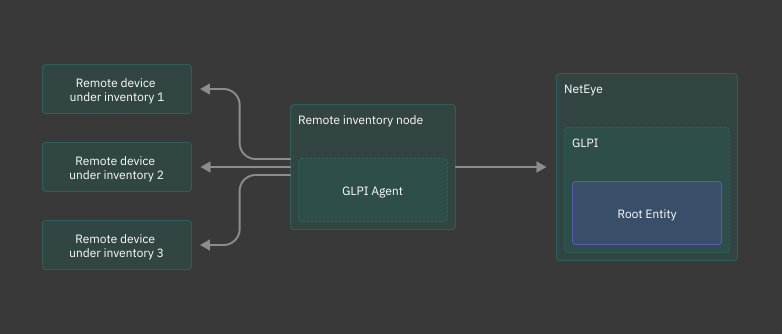

.. _asset-collection-methods:

Asset collection methods
------------------------

Asset collection can be performed with the help of GLPI Agent software that can be used in
two different ways: agentless or agent-based. To correctly install and configure the GLPI Agent
software, the following steps should be executed:

#.  Install GLPI Agent on the desired device following the `official GLPI documentation
    <https://glpi-agent.readthedocs.io/en/latest/installation/index.html>`__.
    GLPI Agent can be installed on both Linux and Windows nodes that are external to
    the |NE| environment.
    For Windows installation we recommend to use the ``.msi`` package.

    .. hint::

        In order to execute ``glpi-agent`` and ``glpi-remote`` commands on Windows machines, be sure to
        operate as administrator from the ``GLPI-Agent`` folder.

#.  Find credentials for the agent: GLPI Agent has a dedicated |NE| user called ``neteye_glpi_agent_<tenant_name>``
    authorized to send assets to the Master. User's password can be found in
    ``/root/.pwd_neteye_glpi_agent_<tenant_name>`` and should be used for authentication when sending inventories.

    For installations with a Single Tenant the default credentials are:

    *   user: ``neteye_glpi_agent_master``
    *   password can be found in ``/root/.pwd_neteye_glpi_agent_master``.

#. Configure the `user and password credentials <https://glpi-agent.readthedocs.io/en/latest/configuration.html#user>`_
   for the agent in `the config file on the system. <https://glpi-agent.readthedocs.io/en/latest/configuration.html#configuration>`_

#.  Choose the node where to send assets:

    *   Master: GLPI Agent can send inventories directly to the Master. In that case, the Master hostname
        should be used as ``<neteye_addr>``.
    *   Satellite: In order to use a Satellite as a proxy to forward assets to the Master, the Satellite
        hostname should be selected as ``<neteye_addr>``

After the first configuration parts has been executed, agent-based or agentless mode should be selected
to start collecting assets.

Agent-based
~~~~~~~~~~~

The inventory can be performed on the node where the GLPI Agent software is installed with
the following command:


Linux:

.. code::

    glpi-agent -f --logger=stderr \
    -s https://<neteye_addr>/glpi/front/inventory.php \
    --tasks inventory

Windows:

.. code::

    glpi-agent -f --logger=stderr ^
    -s https://<neteye_addr>/glpi/front/inventory.php ^
    --tasks inventory

Where ``<neteye_addr>`` is the address of the endpoint, as previously described. Once the inventory has
been performed, the GLPI Agent will send it to the specified target hostname.

More information about the ``glpi-agent`` command can be found in
`glpi-agent <https://glpi-agent.readthedocs.io/en/latest/man/glpi-agent.html>`__.

Agentless
~~~~~~~~~

If no software can be installed on the devices from which assets are collected, agentless mode can
be selected. A GLPI Agent server will perform the inventory on remote devices and subsequently send
assets to the Master. Note that the software GLPI Agent should not be installed on remotes, but only
on a separate node that will act as a server that performs the remote inventory.

.. hint::

    We recommend to use agent-based asset collection method over agentless when applicable,
    since involving agents in the asset collection process proves to be a more secure solution.

.. _figure-agentless-diagram:



   GLPI Agent performs inventories to the remote devices.

**Windows remote configuration**
In order to establish a secure connection with a Windows remote WinRM with **transport HTTPS** should
be correctly configured for a SSL connection. Detailed information can be found in
the `official Microsoft guide
<https://learn.microsoft.com/en-us/troubleshoot/windows-client/system-management-components/configure-winrm-for-https>`__.

GLPI Agent, used as a server between remotes and |NE|, should be configured as it follows:

Linux server configuration
``````````````````````````

#.  Specify the target server: Using agentless mode, the target server should be declared
    before inserting the remotes. You should specify the previously defined parameters with
    the command:

    .. code::

        glpi-agent \
        --server=https://<neteye_addr>/glpi/front/inventory.php

#.  Extract the ID of the specified target server with the command:

    .. code::

        glpi-remote list targets

#.  Add remote devices with the following command:

    For a Linux remote machine:

    .. code::

        glpi-remote \
        add ssh://<remote_user>:<remote_pass>@<addr>/?mode=libssh2 \
        --target <server_id>

    .. hint::

        Make sure to have the perl library ``Net:SSH2`` installed by executing the command
        ``perl -e "use Net:SSH2``.
        ``libssh2`` should also be installed on the server machine.

    For Windows remotes:

    .. code::

        glpi-remote \
        add winrm://<remote_user>:<remote_pass>@<addr>/?mode=ssl \
        --target <server_id>

    *   ``<remote_user>`` and ``<remote_pass>`` are the credentials that GLPI Agent should use on
        remotes to perform the inventory
    *   ``<addr>`` is the IP address or hostname of the remote device
    *   ``<server_id>`` is the ID of the previously inserted target server that can be shown with the
        ``glpi-remote list targets`` command.

    .. warning::

        |NE| Security is granted only if ``mode=libssh2`` and ``mode=ssl`` are used for Linux and
        Windows remotes respectively.

    .. hint::

        By exchanging ssh keys, ``<remote_pass>`` is not needed when adding the remote device.


#.  Execute the remote inventory task of the GLPI Agent to collect assets and send them to the Master:

    .. code::

        glpi-agent -f --logger=stderr --tasks remoteinventory \
        -s https://<neteye_addr>/glpi/front/inventory.php

Where ``<neteye_addr>`` is the address of the endpoint, as previously described in the
:ref:`asset-collection-methods` Once the inventory has been performed, the GLPI Agent will send it
to the specified target hostname.

Windows server configuration
````````````````````````````

#.  Specify the target server: Using agentless mode, the target server should be declared
    before inserting the remotes. You should specify the previously defined parameters with
    the command:

    .. code::

        glpi-agent ^
        --server=https://<neteye_addr>/glpi/front/inventory.php

#.  Extract the ID of the specified target server with the command:

    .. code::

        glpi-remote list targets

#.  Add remote devices with the following command:

    For a Linux remote machine:

    .. code::

        glpi-remote ^
        add ssh://<remote_user>:<remote_pass>@<addr>/?mode=libssh2 ^
        --target <server_id>

    .. hint::

        Make sure to have the perl library ``Net:SSH2`` installed by executing the command
        ``perl -e "use Net:SSH2``.
        ``libssh2`` should also be installed on the server machine.

    For Windows remotes:

    .. code::

        glpi-remote ^
        add winrm://<remote_user>:<remote_pass>@<addr>/?mode=ssl ^
        --target <server_id>

    *   ``<remote_user>`` and ``<remote_pass>`` are the credentials that GLPI Agent should use on
        remotes to perform the inventory
    *   ``<addr>`` is the IP address or hostname of the remote device
    *   ``<server_id>`` is the ID of the previously inserted target server that can be shown with the
        ``glpi-remote list targets`` command.

    .. warning::

        |NE| Security is granted only if ``mode=libssh2`` and ``mode=ssl`` are used for Linux and
        Windows remotes respectively.

    .. hint::

        By exchanging ssh keys, ``<remote_pass>`` is not needed when adding the remote device.


#.  Execute the remote inventory task of the GLPI Agent to collect assets and send them to the :term:`Master`:

    .. code::

        glpi-agent -f --logger=stderr --tasks remoteinventory ^
        -s https://<neteye_addr>/glpi/front/inventory.php

Where ``<neteye_addr>`` is the address of the endpoint, as previously described in the
:ref:`asset-collection-methods` Once the inventory has been performed, the GLPI Agent will send it
to the specified target hostname.

More information about the ``glpi-remote`` command can be found in
`glpi-agent <https://glpi-agent.readthedocs.io/en/latest/man/glpi-remote.html>`__.
